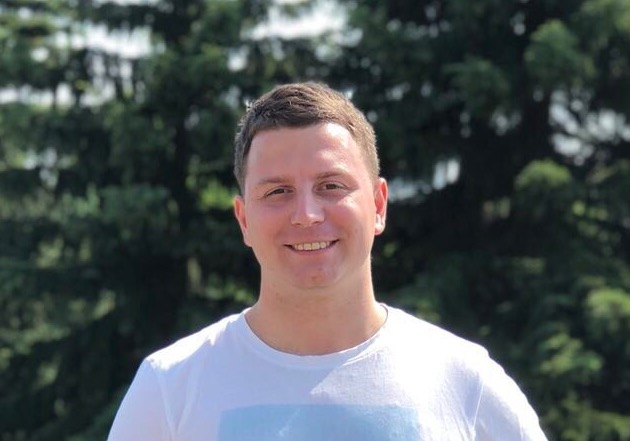

## Globak Maxim

iOS developer

### Personal Information
Phone: +7 (926) 582-03-04  
Email: [Globak.Maxim@gmail.com](mailto:globak.maxim@gmail.com)  
Date of Birth: 19th December 2017  
GitHub: [GlobakMaxim](https://github.com/GlobakMaxim)  

### Skills
##### iOS
  - Objective-C, Swift
  - Core Data, Realm
  - AFNetworking, Alamofire, URLSession
  - Fabric, Google Analytics, FBSDK
  - MVC, MVVM
  - iOS Human interface guidelines
  - Unit tests
  - StoreKit, CoreLocation
##### Other
  - Node.js, PHP (Laravel)
  - IELTS 5.5

### Work Experience

* **Cocoaheads Russia** *OpenSource* - [GitHub](https://github.com/cocoaheadsru/application) [AppStore](https://itunes.apple.com/ru/app/cocoaheads-russia/id1257534277?mt=8)
* **Garage** *Pet-project* - [GitHub](https://github.com/GlobakMaxim/GearApp) [AppStore](https://itunes.apple.com/ru/app/garage-mobile-service-book/id1293507369?mt=8)

---

* May 2016 - Present  
**iOS Developer** at Itella Connexions LLC [http://icnx.ru](http://icnx.ru) Moscow  
	- *The development of mobile CRM systems for iOS.* `Full circle` `In-House`
	- *The development of medium to large mobile applications in a team.*
	- *Full development cycle and design of small mobile applications and communication with the backend team.*
	- *Consultation on mobile application development and design.*  
Technology: `Objective-C, Swift, CoreData, ReactiveCocoa, MVVM, Fabric, etc.`  
Clients: Philip Morris, Audi, VW, Philips, Pernod Ricard

* August 2015 - May 2016 (10 months)  
**iOS Developer** at Service center LLC [http://start-app.ru](http://start-app.ru) Moscow  
    - *Refactoring iOS app 'Krugosvet'*
    - *Writing new functionality*
    - *The publication of the application in AppStore*
    - *ASO*  
Technology: `Objective-C, Realm, MVC, StoreKit, Core Location & Google maps SDK, Google Analytics, etc.`  
[Screenshot](https://github.com/GlobakMaxim/CV/blob/master/krugosvet.jpg)

* February 2014 — December 2014 (11 months)  
**SEO specialist** at Effective site LLC [http://www.analizsaita.ru](www.analizsaita.ru) Moscow   
Optimizing websites for search engines. Creating websites based on CMS systems.

* September 2013 — January 2014 (8 months)
**Director of zoohotel** at JSC Kennel Club "VUK", Zelenograd  
Full organization of business from "zero" (zoo hotels). The project sold.

* June 2011 — September 2011 (4 months)  
**Delivery service** at Brighton Beauty Supply [http://www.brightonbeautysupply.com](http://www.brightonbeautysupply.com), NY  

* May 2009 — may 2011 (2 years 1 month)  
Top Hall night club (ex. Club Z1) [https://vk.com/tophallclub](https://vk.com/tophallclub) Zelenograd  
**Waiter, bartender, photographer**  

### Qualifications
* December 2013 **Website promotion in Internet (SEO)**  
Moscow Institute of Electronics & Technology University (Moscow, Russia)

* September 2008 – July 2012 **Bachelor of software for computer Engineering and computer aided system (Computing resources)**  
Moscow Institute of Electronics & Technology University (Moscow, Russia)

* October 2006 – May 2007 **System administrator courses**  
Moscow Institute of Electronics & Technology University (Moscow, Russia)

* October 2004 – May 2007 **Computer courses** (html, css, php)  
Moscow Institute of Electronics & Technology University (Moscow, Russia)
